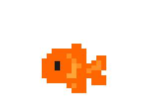
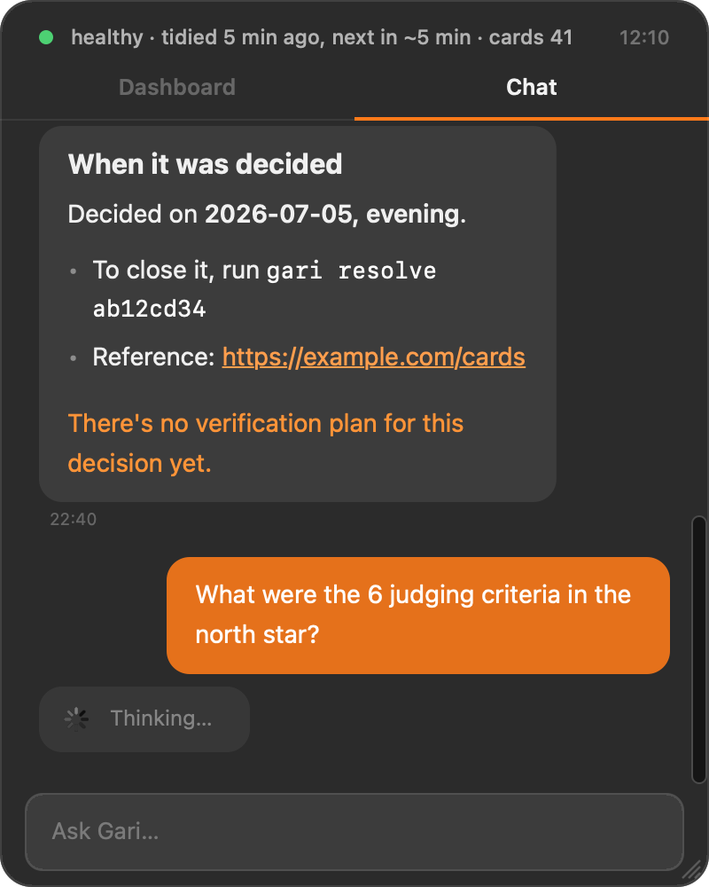

<h1 align="center">
  <br>
  Gari
</h1>

<p align="center"><b>Your AI coding sessions forget. Gari keeps what you decided.</b></p>

<p align="center">
  <a href="https://airu.sh">Website</a> •
  <a href="#quick-start">Quick start</a> •
  <a href="#how-it-works">How it works</a> •
  <a href="docs/NORTH-STAR.md">North star</a> •
  <a href="#faq">FAQ</a>
</p>

<p align="center">
  
  
  
  
</p>

---

Gari reads your **Claude Code** sessions every 10 minutes, keeps the decisions, open questions and corrections **in your own words**, and hands them to the next session — so you never explain the same thing twice.

It lives on your Mac as a small pixel fish. Click it to ask what you decided last week, read this morning's report, or hand off a task.

<p align="center">
  
</p>

## Why

When you build with AI coding agents, the real decisions happen mid-conversation — *"monthly only for now"*, *"no, don't touch auth"*, *"FAQ later"*. Then the session ends and they're gone:

- every new session starts from zero, and you retype context you already gave
- things that were discussed but never decided quietly disappear
- you correct the agent the same way you did last Tuesday

Gari's north star is **zero re-explaining**, and it measures it: re-explanations should go down, context handoffs should go up (`gari northstar`).

## What it does

| | |
|---|---|
| **Remembers** | Distills new turns into cards — `decision`, `pending`, `correction`, `win` — each quoting what *you* said. The AI's own claims never become memory. |
| **Briefs** | The next Claude Code session starts with recent decisions and open items (SessionStart hook, or `gari brief` on demand). |
| **Reports** | A morning report at 9: what got decided, what's still open, one step for today, and a short mentor review. A weekly reflection on Mondays. |
| **Answers** | Ask from the pet or `gari ask` — memory answers in seconds with sources; planning questions go to a deeper model. |
| **Meddles** | Design-thinking and PM lenses flag a missing success metric, verification step or edge case. Every nudge is judged before you see it. |
| **Delegates** | Say what you want, approve with `go`. Gari hands it to Claude Code in an isolated git worktree and checks the real files. Never auto-merges or pushes. |

## Quick start

**Requirements:** macOS · Python 3 · Xcode Command Line Tools · a Claude API key from [console.anthropic.com](https://console.anthropic.com/). Claude Code is optional (needed for `gari do` and document search).

```sh
git clone https://github.com/airudotsh/gari.git ~/gari
cd ~/gari && ./install.sh
```

The installer creates `config.json` and `secrets.env` (mode 600), builds the pet, registers hooks and schedules, and asks four onboarding questions. Then add your key and check:

```sh
echo 'ANTHROPIC_API_KEY=sk-ant-...' >> ~/gari/secrets.env
gari doctor
```

Keep working as usual. Memory answers start within half a day; the first morning report arrives on day two.

## How it works

```
Claude Code session logs (read-only)
        │  every 10 min (launchd sweep)
        ▼
  distill ── Claude Haiku ──▶ store/cards/YYYY-MM-DD.jsonl   (append-only ledger)
        │                          │
        ▼                          ├─▶ store/wiki/<project>.md   current state per project
  gari brief ◀─────────────────────┤
  (next session)                   ├─▶ reports/YYYY-MM-DD.md     morning report · Claude Sonnet
                                   └─▶ gari ask / pet chat       memory · deep answers
```

- **No daemon, no server.** Hooks only drop a note in a queue; launchd runs the sweep.
- **No copies.** Original logs stay where your CLI put them; Gari keeps a read cursor.
- **Fail-loud.** Parse and distill failures are counted, notified and shown in the report.

### Built on Claude

Text-only work — distilling, memory answers, nudge judging, wikis, reviews — goes straight to the **Claude Messages API** with your key. Work that needs tools (reading your repo, web search, delegated coding) runs through **Claude Code**. Aliases like `haiku` and `sonnet` resolve to the newest model. Every call is metered per token in `store/usage.jsonl`; `gari cost` shows the spend and a monthly budget gate warns once.

```jsonc
// config.json
{
  "distill_model": "haiku",   // conversations → cards
  "ask_model":     "haiku",   // memory answers
  "deep_model":    "sonnet",  // planning, mentor, verification
  "prefer_api":    true,
  "language":      "English"
}
```

## Commands

| Command | |
|---|---|
| `gari` | Latest morning report |
| `gari ask "…"` | Ask Gari (memory, planning, general) |
| `gari do "…" [--write]` | Delegate to Claude Code in an isolated worktree |
| `gari brief` | Print the briefing the next session gets |
| `gari northstar` | Re-explanations vs. context handoffs, week over week |
| `gari log` · `resolve <id>` · `snooze <id>` | Read cards, close or snooze open items |
| `gari doctor` · `status` · `cost` | Health, schedules, spend |
| `gari dash` | Local dashboard (127.0.0.1 only) |
| `gari pet` | Show or hide the fish |

Also: `weekly` · `triage` · `wiki` · `project` · `merge` · `cron` · `skill` · `event` · `chat` · `pulse` · `backfill` · `init`.

## Privacy

- Everything lives in one folder. Delete it and Gari is gone.
- No telemetry, no Gari cloud. The only traffic is model calls to the Claude API, with your key.
- `allowlist_paths` / `denylist_paths` in `config.json` decide which projects are ever collected.

## FAQ

**Does it change my code?** Only when you delegate and approve. Work happens in a git worktree; nothing is merged without `gari merge`, and pushing is always yours.

**Does it inject itself into Claude Code?** A SessionStart hook prints a short, factual briefing marked as *not instructions*. Remove the hook and use `gari brief` if you prefer pulling it.

**Other tools?** Codex and gjc session logs are also supported if you use them.

**Windows / Linux?** Not yet — scheduling uses launchd and the pet is native Cocoa.

## Docs

- [NORTH-STAR.md](docs/NORTH-STAR.md) — the problem, the metric, the guardrails
- [INVENTORY.md](docs/INVENTORY.md) — what gets installed and what it can do
- [ARCHITECTURE.md](docs/ARCHITECTURE.md) — where to change what
- [premortem.md](docs/premortem.md) — how Gari could fail, and the defenses

Offline tests: `python3 tests/test_offline.py`

## Status

Pre-release. First version built in July 2026 (see the commit history); rebuilt in English and Claude API-first in October 2026. Made by [Airu](https://airu.sh) · airu@airu.sh

## License

MIT — see [LICENSE](LICENSE).
Pet sprite: "Cute Fish Sprites" by **chips8688** ([OpenGameArt](https://opengameart.org/content/cute-fish-sprites)), OGA-BY 3.0, modified. The artwork is not covered by the MIT license.
